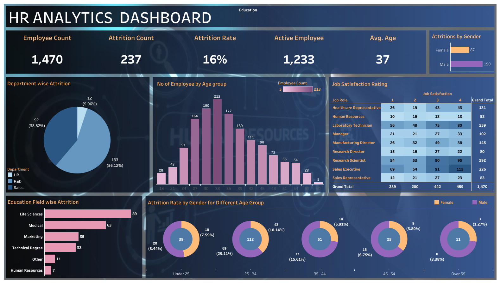

# HR Analytics Dashboard

## Project Overview

This HR Analytics Dashboard was created using Tableau Public to analyze employee attrition, workforce demographics, job satisfaction, and department-level trends.

The purpose of this dashboard is to help HR teams identify attrition patterns, understand employee distribution, and support data-driven workforce planning.

## Dashboard Preview

## Interactive Dashboard

View the interactive dashboard on Tableau Public:

[Open Tableau Public Dashboard](https://public.tableau.com/app/profile/joyce.lee.how.yee/viz/HRAnalyticsDashboard_17637073405650/HRAnalyticDashboard)

## Key Highlights

- Total employees analyzed: 1,470
- Attrition count: 237 employees
- Overall attrition rate: 16%
- Active employees: 1,233
- Average employee age: 37
- Highest attrition is observed in the R&D department
- Employees aged 25 to 34 show a notable attrition pattern
- Life Sciences and Medical education fields have the highest attrition counts

## Dashboard Insights

- The organization has an overall attrition rate of 16%, indicating a meaningful level of employee turnover.
- R&D has the highest attrition count compared to other departments, suggesting a need for closer review of employee experience and retention factors in this department.
- The 25 to 34 age group shows higher employee movement, which may indicate career growth expectations, compensation concerns, or role satisfaction issues.
- Sales Executive and Research Scientist roles show notable attrition patterns and may require targeted retention strategies.
- Job satisfaction ratings vary across job roles, showing potential areas where employee engagement can be improved.

## Business Impact

This dashboard helps HR and management teams:

- Monitor employee attrition trends
- Identify departments and roles with higher turnover
- Understand workforce demographics
- Support employee retention planning
- Improve decision-making through visual HR insights

## Recommendations

- Review retention strategies for departments with higher attrition, especially R&D.
- Conduct employee feedback surveys for roles with notable attrition patterns.
- Analyze compensation, career development, and workload factors for employees aged 25 to 34.
- Improve engagement programs for job roles with lower satisfaction ratings.
- Track attrition trends regularly to measure the effectiveness of HR initiatives.

## Suggested Actions

- Create department-level retention plans.
- Provide career development opportunities for younger employees.
- Review job satisfaction results by role and department.
- Strengthen manager-employee communication.
- Monitor attrition KPIs monthly using the dashboard.

## Tools Used

- Tableau Public
- Data Visualization
- HR Analytics
- Business Intelligence
- Dashboard Design

## Files Included

- `HR_Analytic_Dashboard.png` - Dashboard preview image

## About This Project

This project was created as part of my data analytics portfolio to demonstrate skills in Tableau dashboard design, KPI reporting, business intelligence, and HR data analysis.

